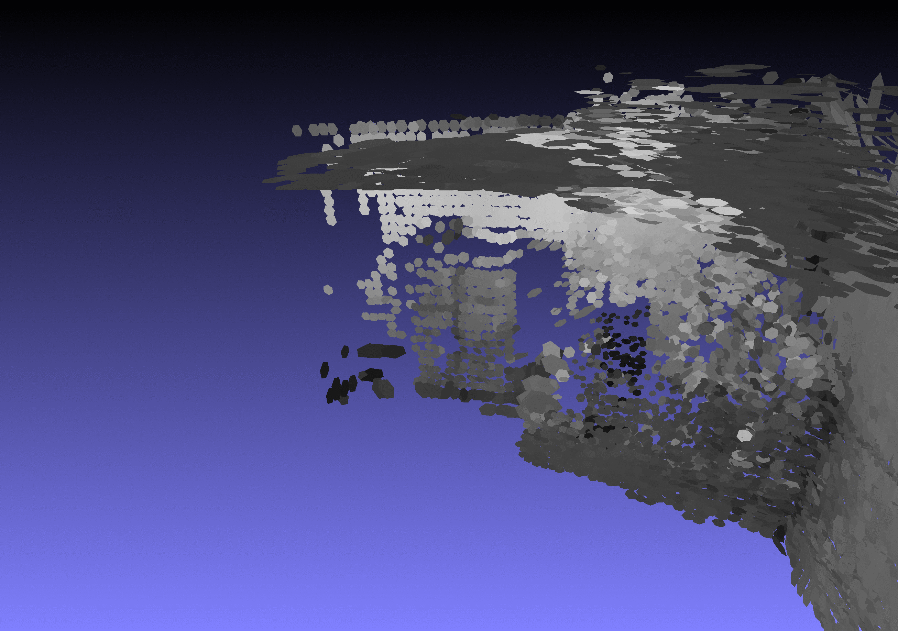

# CS6476 Final Project
### Dense Mapping using Feature Matching and Superpixel Clustering

Mandy Xie, Shicong Ma, Gerry Chen

Dec 4, 2019

## Abstract
<!-- One or two sentences on the motivation behind the problem you are solving. One or two sentences describing the approach you took. One or two sentences on the main result you obtained. -->
One of the fundamental tasks for robot autonomous navigation is to perceive and
digitalize the surrounding 3D environment [@handa2014benchmark]. We replicate
the results of [@Wang19icra_surfelDense] to produce semi-dense, surfel-based
reconstruction using superpixels.

<!-- ### Teaser figure -->
<!-- A figure that conveys the main idea behind the project or the main application being addressed. -->
<!--  -->
<iframe width="560" height="315" src="https://www.youtube.com/embed/hQQgOFnOHQQ" frameborder="0" allow="accelerometer; autoplay; encrypted-media; gyroscope; picture-in-picture" allowfullscreen style="display: block; margin: 0 auto;"></iframe>

## Introduction
<!-- Motivation behind the problem you are solving, what applications it has, any brief background on the particular domain you are working in (if not regular RBG photographs), etc. If you are using a new way to solve an existing problem, briefly mention and describe the existing approaches and tell us how your approach is new. -->
One of the fundamental tasks for robot autonomous navigation is to perceive and
digitalize the surrounding 3D environment [@handa2014benchmark]. To be usable
in mobile robot applications, the mapping system needs to fast and densely
recover the environment in order to provide sufficient information for
navigation.

Unlike other 3d reconstruction methods that reconstructs the environment as a 3D
point cloud, we hope to extract surfels \cite{schops2018surfelmeshing,
pfister2000surfels, tobor2000rendering} based on extracted superpixels from
intensity and depth images and construct a surfel cloud. This approach is
introduced by [@Wang19icra_surfelDense] which can greatly reduces the memory
burden of mapping system when applied to large-scale missions. More importantly,
outliers and noise from low-quality depth maps can be reduced based on extracted
superpixels.

The **goal** of our project is to reproduce results of Wang et al's, namely
implementing superpixel extraction, surfel initialization, and surfel fusion to
generate a surfel-based reconstruction given a camera poses from a sparse SLAM
implementation.  The **input** to our system is an RGB-D video stream with
accompanying camera poses and the **output** is a surfel cloud map of the
environment, similar to Figures 4b or 8 of the original paper
[@Wang19icra_surfelDense].

## Implementation
The idea behind dense mapping is to first generate frame related poses, then
reconstruct the dense map based on pre-generated poses and surfels.

1. Select an RGB-D dataset [@handa2014benchmark; @sturm12iros_TUM; @Menze2015CVPR_KITTI]

2. Read pose information from the dataset / Use a sparse SLAM system (VINS [@qin2018vins]/ORB-SLAM2 [@mur2017orb]) to
estimate camera poses

3. Run code from [@Wang19github] directly to confirm functionality and set benchmark/expectations.

3. **(Implementation)** -- Single frame Superpixels extraction from RGB-D images using a k-means approach adapted from SLIC [@achanta2012slic] - IV.D section in [@Wang19icra_surfelDense]

4. **(Implementation)** -- Single frame surfel generation based on extracted superpixels. - IV.E section in [@Wang19icra_surfelDense]

5. **(Implementation)** --  Surfel fusion and Surfel Cloud update. - IV.G section in [@Wang19icra_surfelDense]

<!-- 6. 3D mesh with surfel cloud. -->

### Dataset
We have started with the _kt3_ sequence of the ICL-NIUM dataset [@handa2014benchmark].  Images and
depth maps have been extracted and examples [shown below](#sec:dataset).

rgb image from ICL-NIUM dataset[]{#sec:dataset}     |  depth image from ICL-NIUM dataset
:-------------------------:|:-------------------------:
 | 
 

### Run Existing Code
The code written for the paper was run to ensure that the results could be
reproduced.  Below are some results of running the code for dense reconstruction on images from the KITTI
dataset [@Menze2015CVPR_KITTI].  We showed that it can indeed produce dense reconstructions.

{width=45%}
{width=45%}

{width=45%}
{width=45%}

### Superpixel Extraction
We have completed single-frame superpixel generation.  The results are [shown
below](#fig:sp_extr).

{#fig:sp_extr width=45%}
{width=45%}

We follow the standard implementation as described in the paper:

1. Initialize superpixel seeds - 
    Superpixel seeds are initialized on a grid of predefined size  
2. Update superpixels  
    1. Pixels are assigned to their nearest superpixel  
    2. Superpixel properties (x, y, size, intensity, depth) are updated
    accordingly.

The number of times that step 2 is repeated depends on the image.  For example,
the ICL-NIUM dataset image requires only 10 iterations or so to stabilize, but the
KITTI dataset image requires roughly 25 to stabilize.  One metric that can
potentially be used in the future as a stopping criteria is the sum of distances
traveled by the superpixels from one iteration to the next.  The superpixel
iteration is complete when they sufficiently small changes occur from one
iteration to the next.

### Surfel Generation and Fusion
<!-- norm calculation -->
<!-- We are in the process of calculating the norm which is needed for surfel
generation.  We expect to complete this very soon. -->

Surfels are modeled with the superpixels extracted from intensity and depth images in the following
method as described in the paper:  

1. Surfel Initialization:  
    Initialize superpixel cluster that has enough assigned seeds with a set of reasonable initial
    values.  
2. Surfel Fusion:  
    Fuse extracted local surfels with newly initalized surfels if they have similar depth and normals. 
    Transform fused local surfels into the global frame, and remove those are updated less than 5
    times.

For the surfel initialization, we transform each superpixel into a surfel according to the
correspondence equations given in [@Wang19icra_surfelDense].  An example of a single frame with each
superpixel processed in this manner is [shown below](#fig:multiframesurfel).

{#fig:singleframesurfel}

To process additional frames, each new surfel from a superpixel in the frame to be added must first
be checked amongst all existing surfels to see if it is similar enough to be fused.  If not, then a
new surfel is initialized.  An example of a cloud consisting of a few frames containing fused
surfels is [shown below](#fig:multiframesurfel).

{#fig:multiframesurfel}

We can see that the reconstruction is much better filled in (denser) and also has better detail.
For example, the filing cabinet achieves much better resolution when putting multiple frames
together. This is partly because multiple surfels can occupy the same location in space if they have
different normal directions.

We have now recreated the dense reconstruction surfel cloud results from [@Wang19icra_surfelDense]
that we sought out to achieve.

## Experiments and results
<!-- Provide details about the experimental set up (number of images/videos, number of datasets you experimented with, train/test split if you used machine learning algorithms, etc.). Describe the evaluation metrics you used to evaluate how well your approach is working. Include clear figures and tables, as well as illustrative qualitative examples if appropriate. Be sure to include obvious baselines to see if your approach is doing better than a naive approach (e.g. for classification accuracy, how well would a classifier do that made random decisions?). Also discuss any parameters of your algorithms, and tell us how you set the values of those parameters. You can also show us how the performance varies as you change those parameter values. Be sure to discuss any trends you see in your results, and explain why these trends make sense. Are the results as expected? Why? -->

A number of parameters can be tuned for surfel generation and a few will be discussed:

1. K-means iterations for superpixel extraction
2. Number of frames used in surfel cloud generation
3. Superpixel size used in initialization of superpixel seeds
4. Outlier removal criteria

We then finish with a qualitative description of the resulting surfel clouds.

### K-means Iterations 
As mentioned earlier and shown in both the [figure above](#fig:sp_extr) and the [figure
below](#fig:sp_iter), the process of extracting superpixels is an iterative one based on k-means.
This means that the number of iterations to run k-means affects how closely the superpixels will
converge to the optimal superpixel assignments.  The animated figures illustrate how the superpixel
assignments change as more iterations are run.  We found that, for the ICL-NIUM dataset, roughly 10
iterations were sufficient while roughly 25 were required for the KITTI dataset.  We follow the lead
of the reference paper [@Wang19icra_surfelDense] and consider the number of iterations a human-tuned
parameter instead of setting a convergence stopping criterion.

{#fig:sp_iter width=100%}
{width=100%}
**Figure:** Superpixel extraction over multiple iterations

### Number of Frames
The number of frames to use to generate a surfel cloud
significantly affects the result.  This is because the pose estimate that we read in was not
completely accurate, so errors accrue with more frames causing inconsistencies in the surfel cloud.
At the same time, too few frames results in sparser clouds with more gaps.  [Shown below](#fig:frames) are examples
of surfel clouds generated with 1, 3, 25, and 50 frames.

{#fig:frames}

### Superpixel Size
The generated surfels result varies when we change the parameters, such as the size of superpixels
and the size of surfels.  The number of superpixels in our implementation does not change during the
k-means process so the size of initialized superpixels affects the general size scale of the final
superpixels as well.  Similarly, surfel size is dependent upon superpixel size because surfels are
initialized from superpixels, so the superpixel initialization density also affects the final sizes
of the surfels.  [Shown below](#fig:size) are examples of surfel clouds generated with initialization superpixel
sizes of 50x50, 25x25, 12x12, and 9x9.  We see that too large superpixels lose detail while too
small superpixels become sparse.

{#fig:size}

### Outlier Removal
Some surfels are poorly conditioned due to factors such as oblique viewpoint, small superpixel
parent, only being visible in few frames, distance to camera, and other factors.  Several checks
exist in our code to eliminate obvious outliers.  One example is removing surfels which don't appear
in many frames.  Surfels which appear in multiple frames get "fused" and we keep track of how many
times a given surfel has been fused.  The [animation below](#fig:outlier) compares a raw surfel cloud and one which
removes surfels fused less than 3 times.  We notice that including these "outlier" surfels generates
a more complete cloud, but at the expense of extra noise.  For example, there is a cluster of surfels to the
right of the filing cabinet which are not oriented correctly.

{#fig:outlier}

### Qualitative Results
<!-- Show several visual examples of inputs/outputs of your system (success cases and failures) that help us better understand your approach. -->
The superpixel-segmented [images below](#fig:kitti_sp) from the KITTI [@Menze2015CVPR_KITTI] dataset demonstrate that the superpixels are indeed segmenting properly
as they tend to "hug" similarly colored/depthed regions.

{#fig:kitti_sp width=100%}
{width=100%}

Converting the superpixels into surfels appears correct based on:

1. The locations of the surfels clearly traces out the room shape (see [reference image](#fig:dataset))
2. The orientations of the surfels are aligned with their neighbors to form planar surfaces
3. The orientations of the surfels match the room shape
4. The orientations of the surfels near corners are slightly "curved" indicating fusing and
   averaging is working properly
5. Overlapping and non-redundancy of surfels from multiple frames indicates fusion is working
   properly to only add new surfels when they are sufficiently different than the nearby surfels.

We can observe these qualitatively from the [rgb image](#fig:dataset) and [example surfel
cloud below](#fig:qualitativeSurfel).

{#fig:qualitativeSurfel}

## Conclusion and Future Work
<!-- Conclusion would likely make the same points as the abstract. Discuss any future ideas you have to make your approach better. -->
We successfully recreated the results of [@Wang19icra_surfelDense] by creating a surfel
cloud given RGBD images and camera poses.
Furthermore, we investigated and reported the effects of various parameters on the resulting surfel
clouds and discussed qualitative results from our reconstructions.

During this project, several difficulties were faces, such as

* Debugging conversions between camera projections, coordinate frames, and data types
* Robustly calculating the normal direction for a surfel which requires applying an outlier-robust
  method of combining approximate normal directions for each pixel contained in a superpixel
* Achieving reasonable performance speed using matrix manipulation instead of for loop and multi-threads in C++ to reduce computationl cost
* Understanding the meaning of different values in a surfel vector 

Future directions include

* Intelligent k-means superpixel stopping criterion
* Faster speed in superpixel extraction
* Better pose estimation that can also feed-back pose corrections based on surfel matches
* Better surfel outlier rejection

## References
<!-- List out all the references you have used for your work -->