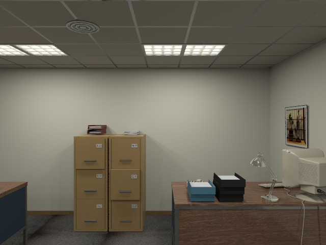

# CS6476 Project Update 1
## Dense Mapping using Feature Matching and Superpixel Clustering

Mandy Xie, Shicong Ma, Gerry Chen

October 31, 2019

### Abstract
<!-- One or two sentences on the motivation behind the problem you are solving. One or two sentences describing the approach you took. One or two sentences on the main result you obtained. -->

### Teaser figure
<!-- A figure that conveys the main idea behind the project or the main application being addressed. -->

### Introduction
<!-- Motivation behind the problem you are solving, what applications it has, any brief background on the particular domain you are working in (if not regular RBG photographs), etc. If you are using a new way to solve an existing problem, briefly mention and describe the existing approaches and tell us how your approach is new. -->
One of the fundamental tasks for robot autonomous navigation is to perceive and
digitalize the surrounding 3D environment\cite{handa2014benchmark}. To be usable
in mobile robot applications, the mapping system needs to fast and densely
recover the environment in order to provide sufficient information for
navigation.

Unlike other 3d reconstruction methods that reconstructs the environment as a 3D
point cloud, we hope to extract surfels \cite{schops2018surfelmeshing,
pfister2000surfels, tobor2000rendering} based on extracted superpixels from
intensity and depth images and construct a surfel cloud. This approach is
introduced by \cite{Wang19icra_surfelDense} which can greatly reduces the memory
burden of mapping system when applied to large-scale missions. More importantly,
outliers and noise from low-quality depth maps can be reduced based on extracted
superpixels.

The **goal** of our project is to reproduce results of Wang et al's, namely
implementing superpixel extraction, surfel initialization, and surfel fusion to
generate a surfel-based reconstruction given a camera poses from a sparse SLAM
implementation.  The **input** to our system is an RGB-D video stream with
accompanying camera poses and the **output** is a surfel cloud map of the
environment, similar to Figures 4b or 8 of the original paper
\cite{Wang19icra_surfelDense}.

### Approach
The idea behind dense mapping is to first generate frame related poses, then
reconstruct the dense map based on pre-generated poses and surfels.

1. Select a RGB-D dataset \cite{handa2014benchmark,sturm12iros_TUM,Menze2015CVPR_KITTI}

2. Read pose information from the dataset / Use a sparse SLAM system (VINS \cite{qin2018vins}/ORB-SLAM2 \cite{mur2017orb}) to
estimate camera poses

3. **(Suggested implementation)** -- Single frame Superpixels extraction from RGB-D images using a k-means approach adapted from SLIC \cite{achanta2012slic} - IV.D section in \cite{Wang19icra_surfelDense}

4. **(Suggested implementation)** -- Single frame surfel generation based on extracted superpixels. - IV.E section in \cite{Wang19icra_surfelDense}

5. **(Suggested implementation)** --  Surfel fusion and Surfel Cloud update. - IV.G section in \cite{Wang19icra_surfelDense}

<!-- 6. 3D mesh with surfel cloud. -->

### Experiments and results
<!-- Provide details about the experimental set up (number of images/videos, number of datasets you experimented with, train/test split if you used machine learning algorithms, etc.). Describe the evaluation metrics you used to evaluate how well your approach is working. Include clear figures and tables, as well as illustrative qualitative examples if appropriate. Be sure to include obvious baselines to see if your approach is doing better than a naive approach (e.g. for classification accuracy, how well would a classifier do that made random decisions?). Also discuss any parameters of your algorithms, and tell us how you set the values of those parameters. You can also show us how the performance varies as you change those parameter values. Be sure to discuss any trends you see in your results, and explain why these trends make sense. Are the results as expected? Why? -->
#### Dataset
We have started with the _kt3_ sequence of the ICL-NIUM dataset.  Images and
depth maps have been extracted and examples shown below.

#### Superpixel Extraction
We have completed single-frame superpixels

#### Surfel Generation
<!-- norm calculation -->

### Qualitative results
<!-- Show several visual examples of inputs/outputs of your system (success cases and failures) that help us better understand your approach. -->

### Conclusion and future work
<!-- Conclusion would likely make the same points as the abstract. Discuss any future ideas you have to make your approach better. -->

### References
<!-- List out all the references you have used for your work -->